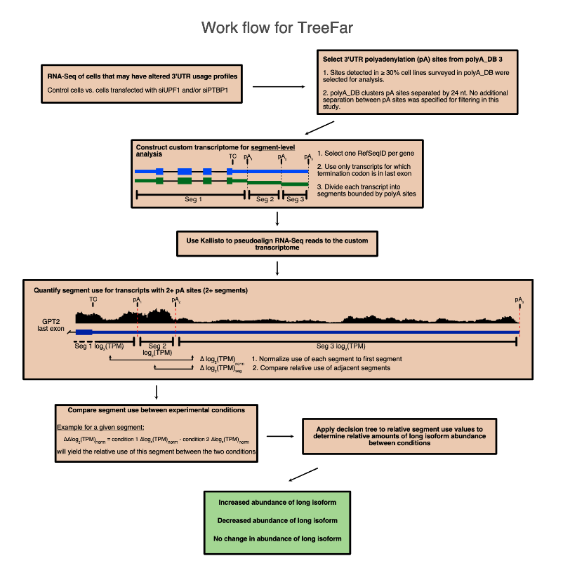

# Decision tree for analysis of RNA APA (TreeFar)
This program was designed to evaluate the relative 3’UTR length differences between two user-defined conditions.  In order to accomplish this, transcripts are divided into sections defined by annotated alternative cleavage and polyadenylation sites. The read abundance in each section is compared between conditions.  The final output of the program is a table with all the relative segment abundances as well as the calculated relative use of the 3’UTR as a whole.

## Features of the segment library used in this study
For the hg19 segment library used in this study, the kallisto index is available for download [here](http://bioinformatics.nhlbi.nih.gov/files/Hogg_Lab/TreeFar/hg19index).
- Segments were defined from polyadenylation (polyA) sites annotated in [PolyA_DB](http://exon.njms.rutgers.edu/polya_db/v3/).  
- Only polyA sites used in greater than 30% of samples in PolyA_DB are represented.
- Transcripts with termination codons not in the last exon were excluded.
- The first segment is from the 5’end of a transcript to the first annotated polyA site, and each subsequent segment is defined by sequential polyA sites (see schematic [here](docs/Work_Flow.pdf)).
To use TreeFar with other quantification tools or to change the polyA site usage filter from 30%, the full list of segments for hg19 is available [here](docs/all_segment_annotations.txt.zip).


TreeFar Workflow 
--------
<p align="center">
  
</p>


## Notes 
- The reference sets provided here are for use with human hg19 annotations.  
- For other annotations and species, the user will need to generate a segment library, but TreeFar may still be used to determine the APA outcome.  Suggestions for this are found at the end of this user guide.
- TreeFar relies on quantification generated by [kallisto](https://pachterlab.github.io/kallisto/about).
- Other quantification tools are also compatible with TreeFar, but the user will have to compile the results into the TreeFar input table.  Guidelines for this are found at the end of this user guide.

# Installation
Packages used for program development (required to run TreeFar)
- Python v3.7.5
- rpy2 v3.2.2
- Numpy v1.17.2
- Pandas v0.24.2
- Scipy v1.4.1
Download the script for TreeFar [here](docs/TreeFar.py).

# Usage
## First, quantify segment usage
Use kallisto to quantify the segments using RNA-Seq data.  Example kallisto output is found [in this folder](docs/contr1_Kallisto_output).  The output columns used by TreeFar are “target_id” and “tpm.”
- The hg19 kallisto index from this study can be found [here](docs/hg19index) and may be used for pseudoalignment if appropriate.
```
kallisto quant -i hg19index -o contr1 --bias -b 1000 -t 16 --rf-stranded FASTQ-files
```

## Second, collect kallisto output for TreeFar to access
For each RNA-Seq dataset, kallisto outputs a folder that is named by the user.  However, the name is not carried through to the files within the folder.
- For each dataset that will be used for TreeFar analysis, move/copy the “abundance.tsv” file into a folder with all of its controls and replicates.  
- Prefix each kallisto output with its name.  Format the file name as “name_abundance.tsv.”  (See example folder provided [here](docs/Output_collected_for_TreeFar)

## Finally, run TreeFar
```
Usage: python TreeFar.py [arguments]

Required arguments:
--files_path, -f			directory of kallisto output files for use by TreeFar
--group_control, -g0		comma separated list of the first set of kallisto output data files (typically control).  The algorithm assumes the kallisto output files are named along the lines of “NT1_abundance.tsv” so you would just put whatever comes before the “_abundance.tsv” in this list.
--group_treatment, -g1	comma separated list of the second set of kallisto output data files (typically test condition).  Similar naming convention as described above.
--out, -o 			File prefix for final output table.  The final output name will be this string + l1 + l0, where the final two components are automatically appended by the algorithm.
--out_main, -x			File prefix for data before filtering and analysis

Optional arguments:
--label_control, -l0		label for condition in -g0 (default: Control).  This will appear also in the output file name.
-l1				label for condition in -g1 (default: Treatment).  This will appear also in the output file name.
--mean_filter			Value of the mean -g0 TPM that defines the lower limit for retaining segments in the analysis.  Greater values are more stringent (default: 0.5).
--missing_filter		The maximum number of missing log2(TPM) values, in either condition, required to retain a segment for analysis (default: 2).
--pval_filter			In datasets with 3 or more replicates for each condition, the P value cutoff used by the decision tree for significant changes.  Greater values are less stringent (default: 0.05).
--cutoff			Minimum difference in mean log2(TPM) between conditions used if number of replicates less than 3 and no t-test is applied.  Greater values are more stringent (default: 0.2)

```
An example command is 
```
python TreeFar.py --files_path Output_collected_for_TreeFar -g0 contr1,contr2,contr3 -g1 8hDex1,8hDex2,8hDex3 -l0 contr -l1 8hDex -o NMD -x Quant
```
# Output file contents

<b>Two output files are generated.</b>
- The first is quantification of all the segments prior to analysis by TreeFar (example [here](docs/ Quant_8hDex_vs_cont.csv)).  
- The second is the final output table (example [here](docs/NMD_8hDex_vs_cont.csv).  Note that the 3’UTR segments filtered out of the analysis are dropped to the end of the table, with the reason for exclusion in the “FILTER” column.
For explanation of segdiff and normdiff calculations, see schematic and the paper methods section.  

<b>The output is a comma-separated file with the following columns:</b><br/>
GeneID: extracted from target_id	<br/>
Segment: extracted from target_id; numbered from 5’-most segment to 3’-most segment, does not re-number if segments are excluded from analysis	<br/>
target_id: Full segment label<br/>	
TPM for each -g0 replicate<br/>
TPM for each -g1 replicate<br/>
GeneName: extracted from target_id<br/>	
Leftcoord: extracted from target_id	<br/>
Rightcoord: extracted from target_id	<br/>
pAsite: extracted from target_id	<br/>
TC: Termination codon, extracted from target_id	<br/>
Usage: % use of pA site defined from PolyA_DB, extracted from target_id<br/>
Strand: extracted from target_id	<br/>
log2tpm for each g0 replicate	<br/>
log2tpm for each g1 replicate	<br/>
is_first: whether this is the first segment of the transcript (1 if yes, 0 if no)	<br/>
is_only: whether this is the only segment of the transcript (1 if yes, 0 if no. Note: if a segment is the only one, both is_first and is_last will be 1)	<br/>
is_last: whether this is the last segment of the transcript (1 if yes, 0 if no)<br/>
meantpm g0 replicates	<br/>
meantpm g1 replicates	<br/>
meanlog2tpm g0 replicates	<br/>
meanlog2tpm g1 replicates<br/>
difflog2tpm g1 condition – g0 condition	<br/>
normdiff for each g0 replicate	<br/>
normdiff for each g1 replicate<br/>
segdiff for each g0 replicate	<br/>
segdiff for each g1 replicate<br/>
normdiffmean for the -g0 replicates	<br/>
normdiffmean for the -g1 replicates	<br/>
segdiffmean for the -g0 replicates<br/>
segdiffmean for the -g1 replicates	<br/>
g1 condition – g0 condition normdiff	<br/>
g1 condition – g0 condition segdiff	<br/>
pvallogtpm	<br/>
pvalnormdiff	<br/>
pvalsegdiff	<br/>
eval: which condition has more representation of the given segment	<br/>
score: point value for each eval code	<br/>
verdict: provided at the first record of each transcript, the results of the decision tree for which condition has the longer 3’UTR <br/>
lastdiff: copy of the norm diff for the last segment of each transcript in line with the first record of each transcript<br/>
FILTER: explanation for why the segment was not included in the analysis<br/>

# Modifications

## Creating a custom segment library
To use TreeFar, transcript segments must be defined and numbered for pseudoalignment. 
- The names of each segment should have values in the following format: 
Transcript GeneID|GeneName|left coordinate|right coordinate|pA site|Termination codon site|frequency of pA site usage|segment of transcript|strand
(See “target_id” column in this [table](docs/Quant_8hDex_vs_cont.csv) for examples of multi-segment transcripts)
- The left and right segment coordinates are specific to each segment (for the first segment, the left will be the beginning of the 5’UTR and the right will be the first polyA site in the 3’UTR; for each subsequent segment, the left will be the previous polyA site and the right will be the current polyA site)
- Termination codon will be the same for all segments of a given transcript
- PolyA_DB 3 provides frequency of usage as a percentage—this may be left blank if a different resource is used for polyA site annotation
PolyA_DB 3 uses the Gene Name for its annotations, so the user will need to assign a GeneID to each transcript (in this case, from RefSeq).  Other databases provide the correspondence between Gene name and RefSeq/Ensembl IDs.
- We recommend using only one transcript body for each gene

## Using another quantification tool
### Convert the segment list to library format required by the quantification tool being used
The 3’UTR segment list (hg19 used in this study can be found [here](docs/segments_bed12.txt)) will need to be formatted for use by the specific quantification algorithm (eg, called by the kallisto `index` command, Salmon `index` command, etc).

### Perform quantification using the selected tool.

### Create data table for use by TreeFar
The quantifications from tools other than kallisto will need to be manually aggregated into a table for use by TreeFar.  At a minimum, the table should include columns for GeneID, segment (numerical value), and TPMs for each replicate.  Labels for the TPM column should be the experimental condition so that TreeFar can perform comparisons.  See [here](data_table_input.txt) for an example input table and below for the command.

In the command line, instead of `--files_path` use `--table` to point to the location of the aggregated output table.

```
python TreeFar.py --table data_table_input.txt -g0 contr1,contr2,contr3 -g1 8hDex1,8hDex2,8hDex3 -l0 contr -l1 8hDex -o NMD -x Quant 
```
In this case, `-g0` and `-g1` will have the list of the column names for the control and treatment conditions, respectively.

# Citations

Kishor et al NAR 2020

Bray NL, Pimentel H, Melsted P, Pachter L. Near-optimal probabilistic RNA-seq quantification Nat Biotechnol. 2016;34(5):525‐527. <a href="https://doi.org/10.1038/nbt.3519" class="" classname="" target="_blank" name="">doi:10.1038/nbt.3519</a>

Wang R, Nambiar R, Zheng D, Tian B. PolyA_DB 3 catalogs cleavage and polyadenylation sites identified by deep sequencing in multiple genomes. Nucleic Acids Res. 2018;46(D1):D315‐D319. <a href="https://doi.org/10.1093/nar/gkx1000" class="" classname="" target="_blank" name="">doi:10.1093/nar/gkx1000</a>

